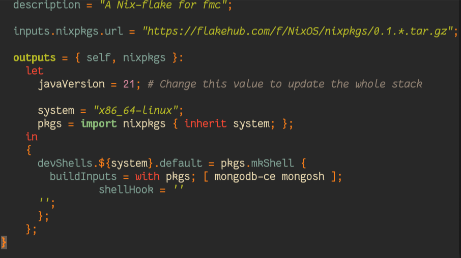
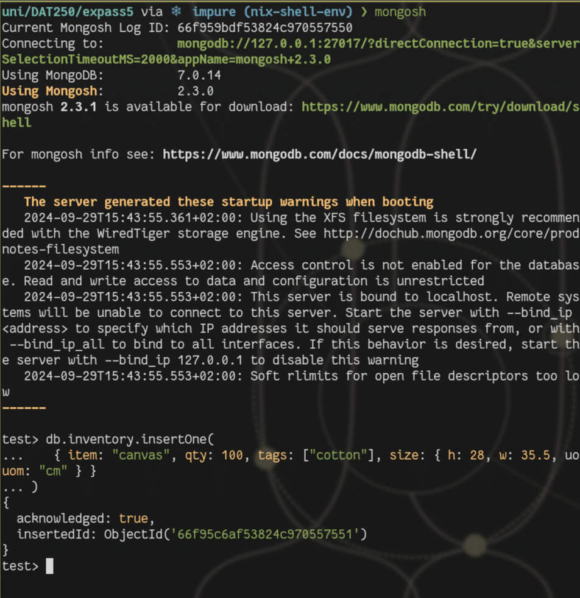
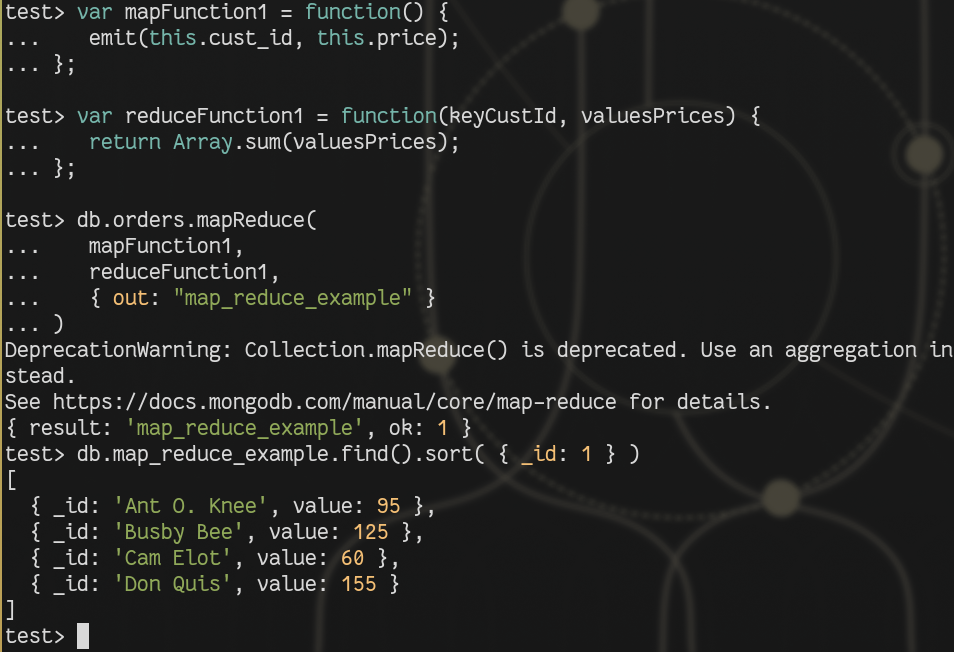
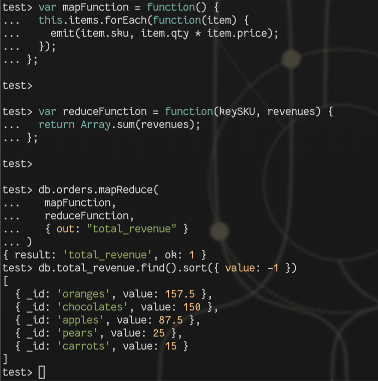

# Expass 5
I am using nix, as I am trying to manage my dev-environments in a good way.
This made it a bit more difficult to figure out how to set up a local database.
But I managed it after a bit of experimentation.
So for the rest of the experiment I will be using an ephemeral environment.
This does however mean I can't do a proper verifying of the package, as I am directly installing from nixpkgs.
This does mean that it is pretty safe.


## Experiment 1
Simple testing with mongodb has been interesting. Trying a non SQL based database is new for me, so is quite fun.

### Inserting
To insert into a database, a collection has to chosen, and if it don't exist, then it will be created.
A document can then be created with an item id, which is able to be searched up later.


### Queryies
You can query collections for object ids pretty easily or ask for everything with the command.
``collection.find( {} )``

Searching for specific qualities are also easy, if you know what to look for.
``db.inventory.find( {tags: "gel"} )``

You can also easily add conditions for if, or, and to query more specific documents.

### Updating documents
Updating can be done on a single document or more with updateMany or updateOne.
If there is a drastic update, then maybe a replace command is better, that just overwrites everything in the object except the id.
``db.inventory.updateOne(``

### Deletion
Easy, pretty much updating, but just deletion, conditions and everything else is the same.
``db.inventory.deleteMany({})``

### Bulk write operations
Are split into ordered and unordered operations.
Ordered are more secure and serialised as the operations are done one at a time, while unordered are running in parallel.
Easily said, bulkwriting is doing a bunch of commands to a collection at.

## Experiment 2
Doing the map reduce:
``
test> db.orders.mapReduce(
...    mapFunction1,
...    reduceFunction1,
...    { out: "map_reduce_example" }
... )
DeprecationWarning: Collection.mapReduce() is deprecated. Use an aggregation instead.
See https://docs.mongodb.com/manual/core/map-reduce for details.
{ result: 'map_reduce_example', ok: 1 }
test> db.map_reduce_example.find().sort( { _id: 1 } )
[
  { _id: 'Ant O. Knee', value: 95 },
  { _id: 'Busby Bee', value: 125 },
  { _id: 'Cam Elot', value: 60 },
  { _id: 'Don Quis', value: 155 }
]
test>
``

My own additional operation.
Which just collects the total revenue based on each sku instead of going for cust_id.
```
var mapFunction = function() {
  this.items.forEach(function(item) {
    emit(item.sku, item.qty * item.price);
  });
};

var reduceFunction = function(keySKU, revenues) {
  return Array.sum(revenues);
};

db.orders.mapReduce(
   mapFunction,
   reduceFunction,
   { out: "total_revenue" }
)
```
And getting the output with
``
db.total_revenue.find().sort({ value: -1 })
``

