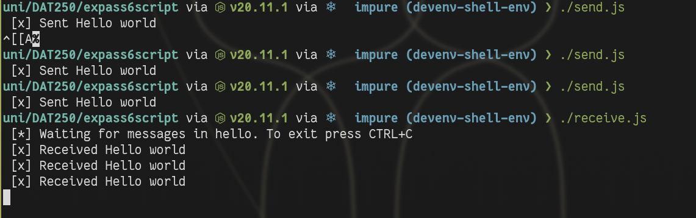
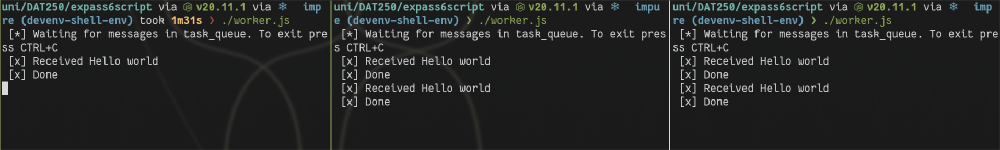
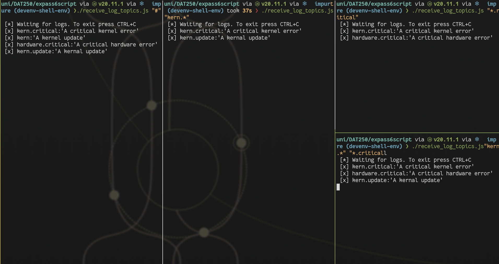

# Expass 6
## Issues
Struggled a bit with installing and making sure rabbitmq was running. I also tried to do it with java first but struggled to find a easy way to do it without running the classes seperatly.
I therefore just went with js. And that was pretty much painless as expected.

The pictures below are from the terminal showing the different ways I tested rabbitmq for both topics workqueues and the simple helloworld.

The code is in the folder Expass6 in this directory.

