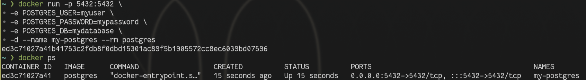
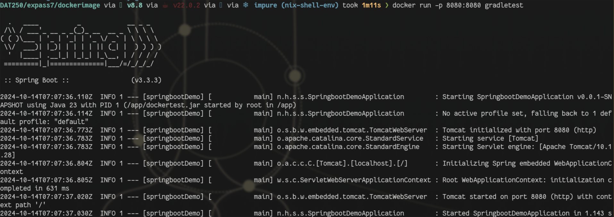
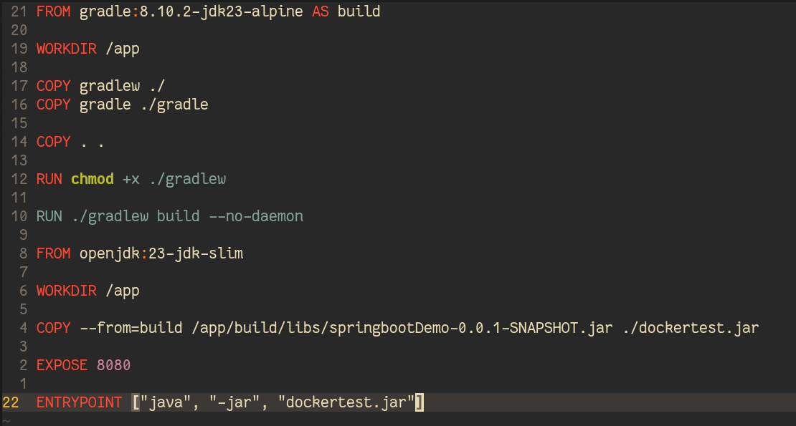

# Expass 7
## Issues
Had some problems with the java version, as I was using java22 for the application, but the gradle image only supported java 21 or 23
Fixed it by converting to java 23 though.

## Code
As always the code can be found in the expass7 folder to the respective parts of the exercise.

## Postgres

## Dockerimage

